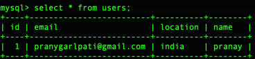

Steps to run

1. mvn clean install
2. docker-compose up --build
3. run application class

for this branch, i implemented using jwt

http://localhost:9191/user

the above url cannot be accepted till i give the correct name and location of id 1 of users table

configuration is in that way, ideally it has to be User table but there was some issue with that 

so my id and password would be name and location (i.e) pranay and india